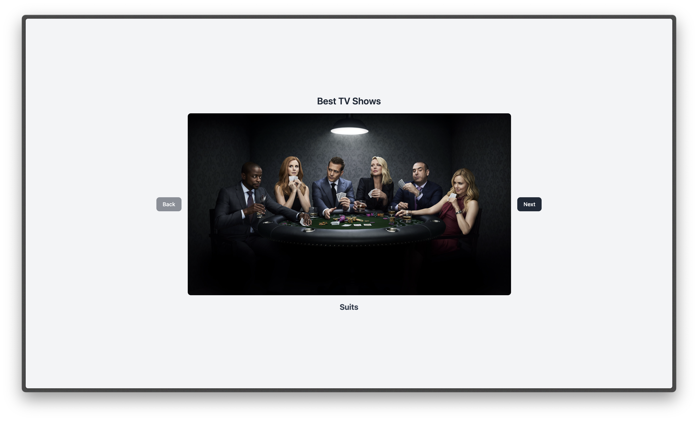

# Best TV Shows

## Fonctionnement

### Structure HTML :

Un conteneur contient le carrousel, incluant une zone d'affichage de l'image et des boutons de navigation.

L'élément `id="carrousel_img"` est utilisé pour afficher dynamiquement les images.

Les boutons `(id="carrousel_back"` et `id="carrousel_next")` permettent la navigation.

Une balise `p (id="showName")` affiche le nom de la série télévisée en cours.

### Fonctionnalité JavaScript :

Un tableau tvshows contient des objets avec les noms des séries TV et les noms des fichiers d'image correspondants.

La variable `index_imgs` suit l'image actuellement affichée.

La fonction `checker()` active/désactive les boutons de navigation en fonction de la position de l'index.

Les écouteurs d'événements sur `carrousel_next` et `carrousel_back` mettent à jour l'image et le texte affichés en fonction de `index_imgs`.

L'attribut src de `carrousel_img` est mis à jour dynamiquement pour afficher l'image correspondante.

Le innerText de `showName` est mis à jour pour refléter le nom de la série actuelle.

### Logique de navigation :

Cliquer sur "Suivant" incrémente `index_imgs` et met à jour l'affichage.

Cliquer sur "Précédent" décrémente `index_imgs` et met à jour l'affichage.

Si index_imgs est au début `(0)`, le bouton "Précédent" est désactivé.

Si index_imgs est sur le dernier élément `(tvshows.length - 1)`, le bouton "Suivant" est désactivé.
